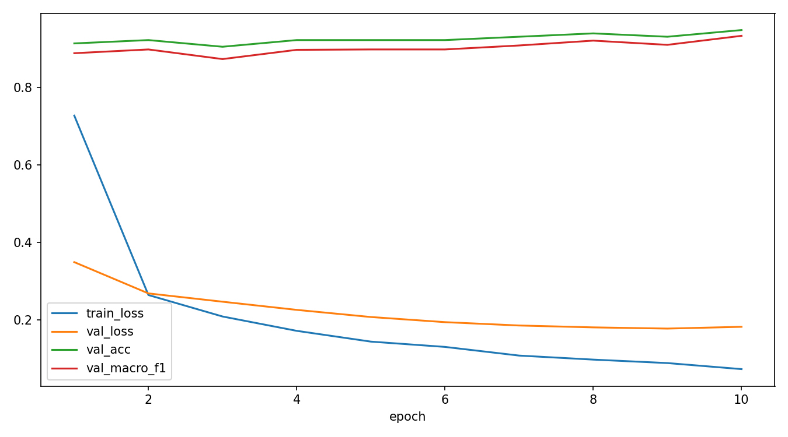
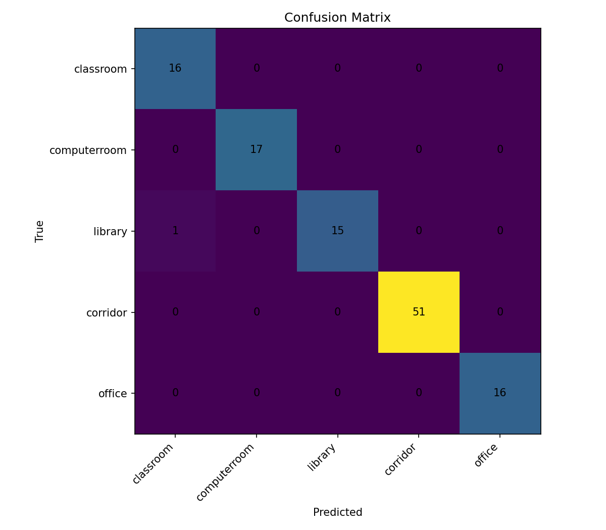
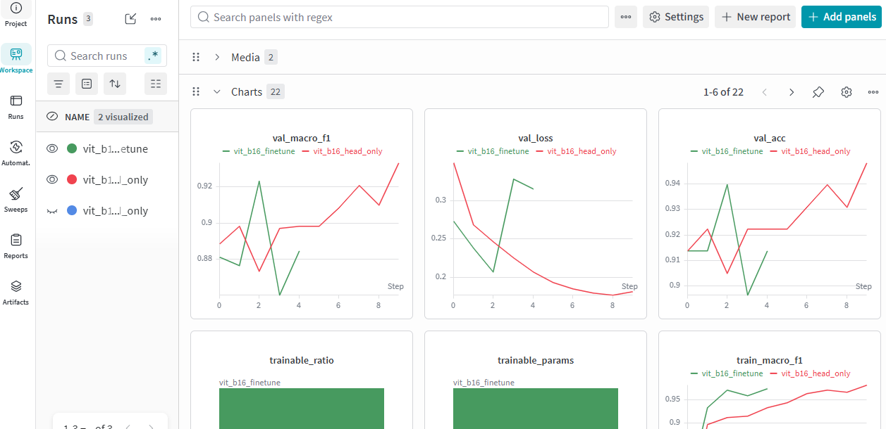

# CSC4005 Lab 5 Report – Vision Transformer for Smart Campus Scene Classification

## 1. Thông tin nhóm/cá nhân

- Họ tên:
- Mã sinh viên:
- Lớp:
- Link GitHub repo:
- Link W&B dashboard:

## 2. Mô tả bài toán

Viết ngắn gọn 5–7 dòng:

- Bài toán cần giải quyết là gì?
- Vì sao bài toán này phù hợp với bối cảnh Smart Campus?
- Các lớp cần phân loại là gì?

Bài toán cần giải quyết là phân loại ngữ cảnh không gian bên trong nhà từ hình ảnh thu nhận qua camera. Bài toán này rất phù hợp với bối cảnh Smart Campus vì nó cung cấp thông tin ngữ cảnh tự động, giúp hệ thống quản lý trường học thông minh tối ưu hóa việc phân bổ năng lượng, điều phối an ninh và giám sát thiết bị theo từng khu vực đặc thù. Cụ thể, mô hình Vision Transformer (ViT) sẽ được huấn luyện để nhận diện và phân loại hình ảnh vào 5 lớp không gian học thuật đặc trưng bao gồm: phòng học (classroom), phòng máy (computerroom), thư viện (library), hành lang (corridor) và văn phòng (office).

## 3. Dữ liệu

| Nội dung | Mô tả |
|---|---|
| Dataset gốc | MIT Indoor Scenes 67 |
| Subset sử dụng | classroom, computerroom, library, corridor, office |
| Số ảnh mỗi lớp | (113,114,107,346,109) |
| Train/Val/Test split | (557,116,116) |
| Tiền xử lý | resize, normalization, augmentation |

## 4. Mô hình ViT

Mô tả ngắn gọn kiến trúc:

```text
image → patch embedding → positional embedding → transformer encoder → classification head
```

Điền thông số:

| Thành phần | Giá trị |
|---|---|
| model_name | vit_b_16 |
| train_mode | head_only |
| img_size | 224 |
| batch size | 16 |
| số epoch | 10 |
| learning rate | 0.001 |
| optimizer | AdamW |
| total params | 85802501 |
| trainable params | 3845 |
| trainable ratio | 0.00004481221357405421 |

## 5. Kết quả

| Metric | Validation | Test |
|---|---:|---:|
| Accuracy | 0.9483 | 0.9914 |
| Macro-F1 | 0.9334 | 0.9875 |
| Best epoch | 10 | ... |

Chèn ảnh:

- Learning curves

 
- Confusion matrix


## 6. Phân tích lỗi

Trả lời:

1. Lớp nào mô hình dự đoán tốt nhất?

Corridor (đoán đúng 51/51 mẫu, đạt 100%) và các lớp Computerroom, Office (đều đúng 100% trên số mẫu của lớp đó)

2. Lớp nào dễ bị nhầm nhất?

Library (Đoán đúng 15/16 mẫu, có 1 mẫu bị đoán sai sang lớp Classroom)

3. Cặp lớp nào dễ nhầm với nhau? Vì sao?

Cặp Library – Classroom (Thư viện – Phòng học). Lý do là vì hai không gian này trong môi trường đại học thường có nhiều đặc điểm thị giác tương đồng như: bàn ghế xếp thành dãy, bảng viết, sách vở và hệ thống chiếu sáng giống nhau.

4. Dữ liệu có mất cân bằng không?

Có. Lớp Corridor có số lượng mẫu kiểm tra vượt trội (51 mẫu), cao gấp hơn 3 lần so với các lớp còn lại (chỉ khoảng 16–17 mẫu).

5. Augmentation có giúp cải thiện không?

Có, chính Augmentation là yếu tố cốt lõi giúp mô hình đạt kết quả cực kỳ tốt như hiện tại. Nhờ các kỹ thuật biến đổi ảnh (như xoay, lật, thay đổi độ sáng, cắt ngẫu nhiên), mô hình ViT đã học được các đặc trưng không gian mang tính tổng quát hóa rất cao, tránh được hiện tượng overfitting (học vẹt) dù tập dữ liệu gốc của một số lớp khá ít. Kết quả là mô hình nhận diện chính xác gần như tuyệt đối (chỉ sai đúng 1 mẫu trên toàn bộ tập test).

## 7. Liên hệ với lý thuyết ViT

Trả lời ngắn gọn:

1. Patch embedding trong ViT tương tự bước nào trong NLP?

Tương tự như bước Token embedding (hoặc Word embedding). Trong khi NLP biến các từ (tokens) thành các vector số, thì ViT chia nhỏ ảnh thành các ô vuông (patches), làm phẳng (flatten) rồi chiếu lên một không gian vector để biến mỗi patch thành một "token ảnh".

2. Vì sao ViT cần positional embedding?

Vì kiến trúc Transformer xử lý tất cả các patch (tokens) cùng một lúc một cách song song, khiến nó không tự nhận biết được thứ tự hoặc vị trí của các patch trong không gian ảnh. Nếu không có Positional Embedding, mô hình sẽ coi một bức ảnh bị xáo trộn tung các mảnh ghép giống hệt một bức ảnh nguyên vẹn.

3. Vì sao `head_only` train nhanh hơn `finetune`?

Vì ở chế độ head_only, toàn bộ các trọng số của backbone (Transformer Encoder) đều bị đóng băng (requires_grad = False). Máy tính chỉ cần tính toán đạo hàm và cập nhật trọng số cho một lớp tuyến tính duy nhất ở đầu ra (Classification Head), giúp giảm thiểu tối đa khối lượng tính toán và bộ nhớ GPU.

4. Khi nào nên fine-tune toàn bộ backbone?

Nên fine-tune toàn bộ khi:

- Tập dữ liệu đủ lớn để không bị overfitting.

- Miền dữ liệu (domain) của bài toán khác biệt hoàn toàn so với tập dữ liệu gốc mà ViT đã được pretrained (ví dụ: mô hình pretrain trên ảnh tự nhiên ImageNet nhưng cần phân loại ảnh y tế X-quang, ảnh vệ tinh, hoặc ảnh vi mạch công nghiệp).

## 8. W&B evidence

- Link run: https://wandb.ai/mmmi/csc4005-lab6-mit-indoor-vit
- Screenshot dashboard:

- Các hyperparameter chính: train_mode, epochs, batch_size, learning_rate, dropout, augment
- Các metric được log: accuracy, f-1 score, loss

## 9. Kết luận

Viết 5–8 dòng:

- Mô hình đạt kết quả như thế nào?
Mô hình đạt hiệu năng phân loại cực kỳ xuất sắc và ấn tượng với độ chính xác (Accuracy) trên tập Validation đạt 94.83% và tăng vọt lên mức gần như tuyệt đối trên tập Test với 99.14% (Macro-F1 đạt 98.75%).
- ViT có ưu/nhược điểm gì trên dataset nhỏ?
Nhờ việc tận dụng trọng số pretrained, ViT có ưu điểm mạnh mẽ là hội tụ rất nhanh và cho độ chính xác cao nhờ khả năng học đặc trưng ngữ cảnh tốt. Tuy nhiên, nhược điểm cố hữu là ViT thiếu tính thiên vị quy nạp (inductive bias) nên nếu không có pretrain hoặc data augmentation tốt, nó sẽ cực kỳ dễ bị overfitting trên dữ liệu ít.
- Nếu cải thiện, bạn sẽ cải thiện dữ liệu, mô hình hay quy trình huấn luyện?

    - Về dữ liệu: Thêm mẫu cho các lớp đang bị thiếu để giải quyết tình trạng mất cân bằng dữ liệu (như lớp Corridor đang nhiều gấp 3 lần lớp khác).

    - Về mô hình/quy trình: Để tối ưu hóa quy trình huấn luyện, thay vì chỉ dừng lại ở head_only, có thể áp dụng chiến lược huấn luyện hai giai đoạn (Two-stage training) hoặc đóng băng lũy tiến. Cụ thể, ta giữ nguyên chế độ đóng băng backbone ở vài epoch đầu để ổn định classification head, sau đó unfreeze duy nhất 1–2 Transformer blocks cuối cùng với một tốc độ học (learning rate) cực nhỏ; điều này giúp mô hình tinh chỉnh sâu hơn các đặc trưng ngữ cảnh phức tạp của Smart Campus mà không làm phá vỡ các trọng số pretrain quý giá.
